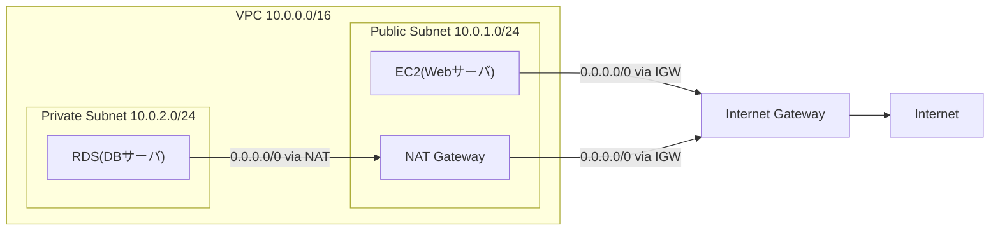

狙い：VPC/CIDR/Subnet/Route/IGW/NAT/SG を口頭説明できる状態にする（面接・現場の疎通トラブル対応で使える）

## 1) まず“通信説明の型”

1. **どのIP帯？** → CIDR
2. **どの箱の中？** → VPC / Subnet
3. **どっちへ流す？** → Route / IGW / NAT
4. **通していい？** → SG

## 2) 用語ごとのメモ

### VPC（箱）

- **一言で**：AWS内に作る「自分専用のネットワーク空間（論理的に隔離された箱）」
- **VPCで決めること**：
    - IP範囲（CIDR）
    - Subnet分割（区画）
    - Route（どこへ流すか）
- **勘違いしがち**：VPCを作っただけではインターネットに出られない（IGW + ルートが必要）

### CIDR（住所の範囲）

- **一言で**：そのネットワークで使う「IPアドレスの範囲」
- **なぜ必要？**：どのIPが“自分のネットワーク内/外”か判定するため
- **例**：VPC= `10.0.0.0/16`（この箱の住所は10.0.x.xの範囲）
- **設計の注意**：オンプレ/VPN/他VPCとIPが被ると、経路設計や疎通で詰む

### Subnet（区画）

- **一言で**：VPCのCIDRをさらに区切った「区画」
- **何のため？**：用途分離（公開/非公開、アプリ/DB）と、AZ単位の配置
- **Public / Private の違い（重要）**：
    - Public subnet：`0.0.0.0/0 → IGW` のルートを持つ
    - Private subnet：直接IGWへ出さない（必要なら `0.0.0.0/0 → NAT`）
- **勘違いしがち**：「パブリックIPがある=Public subnet」ではない（判断はRoute Table側）

### Route / Route Table（道案内）

- **一言で**：宛先IPに対して「次にどこへ送るか」を決める道案内
- **見るべき項目**：
    - Destination（宛先CIDR）
    - Target（送り先：local / igw / nat / vgw / peering / tgw …）
- **最重要2つ**：
    - `local`：VPC内通信
    - `0.0.0.0/0`：それ以外全部（インターネット方面）
- **Subnetとの関係**：Route TableはSubnetに紐づく（どの区画がどの道案内を使うか）

### IGW（玄関：インターネット接続）

- **一言で**：VPCとインターネットを繋ぐ「出口/入口」
- **セットで必要**：
    - Route Tableで `0.0.0.0/0 → IGW`
    - 外に出るリソース側に“パブリックIP（または同等の外向き要素）”が必要

### NAT（代理出口：内→外専用）

- **一言で**：Private subnetから外へ出るときに、通信を「代理で」出してくれる仕組み
- **用途**：Private subnetのEC2がアップデート/外部API通信をしたい（ただし外には公開しない）
- **配置とルート（必須セット）**：
    - NATはPublic subnet側に置く（IGWへ出られる場所）
    - Private subnet側のRoute Tableで `0.0.0.0/0 → NAT`
- **勘違いしがち**：NATがあっても外部から中へ入ってこれるわけではない（基本は内→外）

### SG（Security Group：ドアマン）

- **一言で**：インスタンス等に付ける「通信許可リスト」（ステートフルなファイアウォール）
- **見るべき観点**：
    - Inbound：入ってくる通信を許可する条件
    - Outbound：出ていく通信を許可する条件
- **ステートフル**：行き（リクエスト）を許可した通信の“戻り”は基本自動で許可される
- **推奨される設定**：送信元をCIDRより「送信元のSG」に設定する（送信元経由の通信だけ通す）

**なぜCIDRよりSGがいい？**

- 最小権限にできる
    - `10.0.0.0/16` 許可だと、同VPC内の別のEC2やLambda等からも叩ける余地が増える
    - SG指定だと「ALBに付いてるSGを持つものだけ」になる
- IPが変わっても壊れない
    - オートスケールや差し替えでALB配下の実体が変わっても、SGでグルーピングできる
- “経路を強制”できる
    - EC2がPublicにいても「ALB経由でしか入れない」状態を作りやすい（直アクセスを防げる）

## 3) 最小構成（Notion簡易図）

## 4) 最小構成の“通信パターン”

### パターンA：Public subnetのEC2がインターネットに出る

- EC2 → Route（`0.0.0.0/0 → IGW`）→ IGW → Internet
- 途中でSGのOutboundが許可されている必要がある

### パターンB：Private subnetのEC2がインターネットに出る

- EC2 → Route（`0.0.0.0/0 → NAT`）→ NAT（Public subnet）→ Route（`0.0.0.0/0 → IGW`）→ IGW → Internet

### パターンC：インターネットからWebへアクセス（外→中）

- Internet → IGW → Public subnet → EC2/ALB
- SGのInbound（80/443など）が許可されている必要がある

## 5) トラブルシュートの切り分け（順番）

1. **IP/所属確認**：そのリソースはどのSubnet？（Public/Private）
2. **Route確認**：そのSubnetのRoute Tableで、宛先（例：`0.0.0.0/0`）がどこ向き？
3. **IGW/NATの存在確認**：
    - PublicならIGWはアタッチ済み？
    - PrivateならNATはPublicにいて、PrivateからNATへ向いてる？
4. **SG確認**：Inbound/Outboundで落としてない？（特に見落としやすいOutbound）
